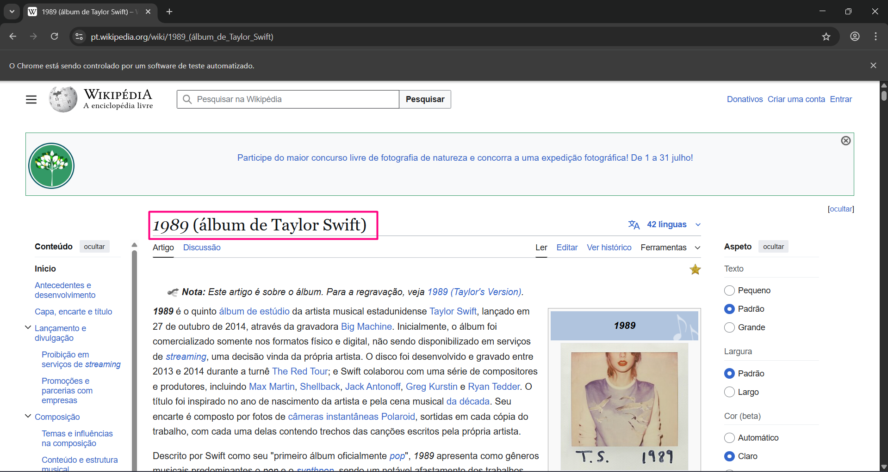
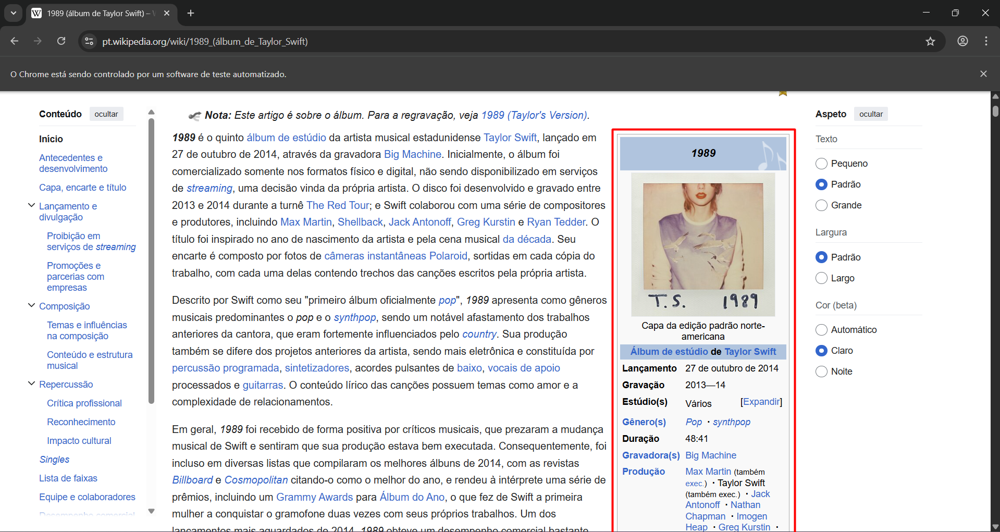
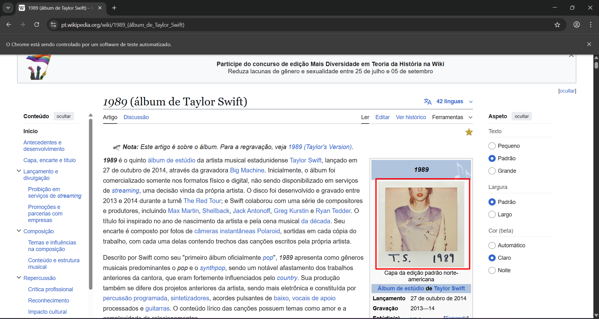
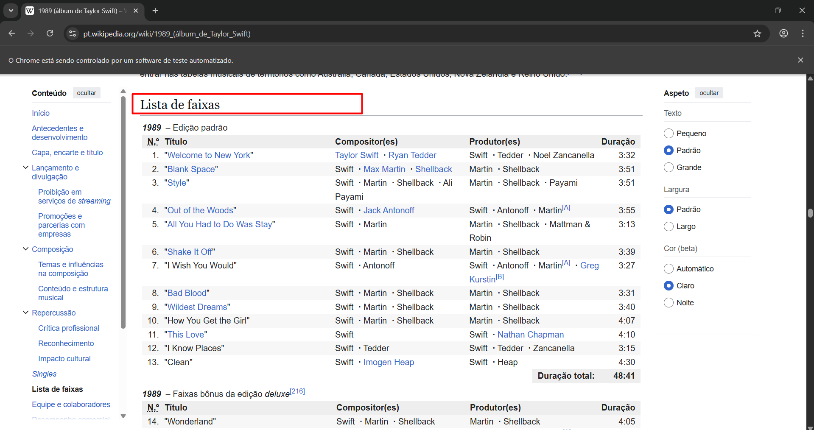
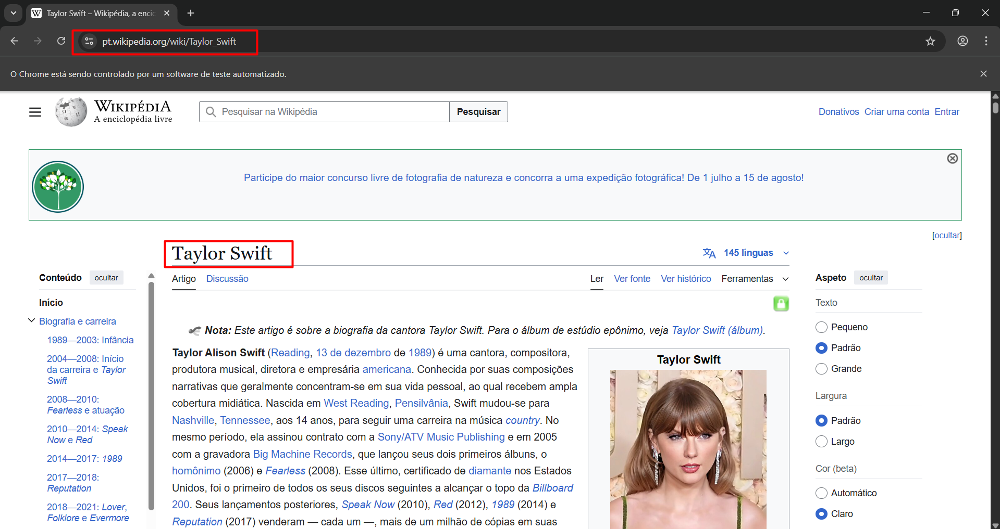

## Casos de Testes - Automação Página Wikipedia Álbum 1989 - Taylor Swift 🩵🎤✨

### ⚪ TC1: Verificar título da página sobre o álbum 1989
- Pré-condições: Ter a URL correta do álbum
- Steps:  
    1. Acessar a página da Wikipedia sobre o álbum 1989 da Taylor Swift.
    2. Verificar se o texto "1989 (álbum de Taylor Swift)" está presente.
- Resultado esperado: o texto "1989 (álbum de Taylor Swift)" deve estar presente no título da página.
- Resultado obtido: OK / Passou.
- Evidências:  
 

    

  

### ⚪ TC2: Verificar se a caixinha “infobox” está presente na página
- Pré-condições: Ter a URL correta do álbum
- Steps:  
    1. Acessar a página da Wikipedia sobre o álbum 1989 da Taylor Swift.
- Resultado esperado: A caixinha "Infobox" deve estar presente na página sobre o álbum 1989
- Resultado obtido: OK / Passou.
- Evidências:  
 

    

  

### ⚪ TC3: Verificar se há uma imagem da capa do álbum
- Pré-condições: Ter executado o CT2
- Steps:  
    1. Acessar a página da Wikipedia sobre o álbum 1989 da Taylor Swift.
    2. Verificar se a imagem da capa do álbum está presente dentro da caixinha "Infobox".
- Resultado esperado: A imagem da capa do álbum deve estar presente na caixinha "Infobox" da página.
- Resultado obtido:  OK / Passou
- Evidências:
 

    

  

### ⚪ TC4: Checar se existe a seção “Lista de Faixas”
- Pré-condições: Estar na página sobre o álbum 1989
- Steps:  
    1. Verificar se existe a seção "Lista de Faixas" do álbum 1989.
- Resultado esperado: A seção "Lista de Faixas" do álbum 1989 deve estar presente.
- Resultado obtido: OK / Passou
- Evidências:
 

    

  

### ⚪ TC5: Direcionar para a página sobre a Taylor Swift
- Pré-condições: Estar na página sobre o álbum 1989 e ter executado o CT2
- Steps:  
    1. Na caixinha "Infobox", verificar se o link para acesso à página sobre a cantora Taylor Swift está presente.
    2. Clicar no link de acesso à página sobre a cantora Taylor Swift.
    3. Verificar se a página de direcionamento em questão contém o título "Taylor Swift"
- Resultado esperado: Ser direcionado para a página sobre a cantora Taylor Swift e verificar se seu nome está presente no título da página.
- Resultado obtido: OK / Passou
- Evidências:
 

    

